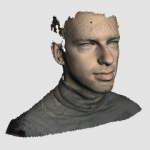

<!-- BEGIN HEADER -->
# class-9-10
<!-- END HEADER -->

This repository is yours to keep track of what you've covered so far, to get to know each other, to share helpful resources, to practice collaboration workflows, ... to do everything!

Slack is great for chatting but links and good explanations can easily get lost in message history.  Think of this repository as your class' forum and home page.

<!-- BEGIN LINKS -->

- [Homework Boards](https://github.com/hackyourfuturebelgium/class-9-10/projects)
- [Class Issues](https://github.com/hackyourfuturebelgium/class-9-10/issues)
    - [`help-wanted`](https://github.com/hackyourfuturebelgium/class-9-10/issues?q=label%3Ahelp-wanted)
    - [`review`](https://github.com/hackyourfuturebelgium/class-9-10/issues?q=label%3Areview)
    - [`roll-call`](https://github.com/hackyourfuturebelgium/class-9-10/issues?q=label%3Aroll-call)
- [Pull Requests](https://github.com/hackyourfuturebelgium/class-9-10/pulls)
- [Randomizer](https://hackyourfuture.be/class-9-10/randomizer)
- [Shared Notes](./shared-notes)

<!-- END LINKS -->

## HYF Links

- [Guidebook](https://home.hackyourfuture.be/students)
- [Curriculum](https://home.hackyourfuture.be/curriculum)
- [Study](https://study.hackyourfuture.be)

---

<!-- BEGIN MODULES -->
<h2>Modules</h2>

expand

1. ### [working-with-code](https://hackyourfuture.be/working-with-code)
    - `1 week`| _[project board](https://github.com/hackyourfuturebelgium/class-9-10/projects/1)_ | _[`individual`](https://github.com/hackyourfuturebelgium/class-9-10/issues?q=milestone%3Aworking-with-code+label%3Aindividual)_ | _[all issues](https://github.com/hackyourfuturebelgium/class-9-10/milestone/1)_ | _[recordings](https://hackyourfuture.be/working-with-code#class-recordings)_

1. ### [incremental-development](https://hackyourfuture.be/incremental-development)
    - `3 weeks`| _[project board](https://github.com/hackyourfuturebelgium/class-9-10/projects/2)_ | _[`individual`](https://github.com/hackyourfuturebelgium/class-9-10/issues?q=milestone%3Aincremental-development+label%3Aindividual)_ | _[all issues](https://github.com/hackyourfuturebelgium/class-9-10/milestone/2)_ | _[recordings](https://hackyourfuture.be/incremental-development#class-recordings)_

1. ### [debugging](https://hackyourfuture.be/debugging)
    - `2 weeks`| _[project board](https://github.com/hackyourfuturebelgium/class-9-10/projects/3)_ | _[`individual`](https://github.com/hackyourfuturebelgium/class-9-10/issues?q=milestone%3Adebugging+label%3Aindividual)_ | _[all issues](https://github.com/hackyourfuturebelgium/class-9-10/milestone/3)_ | _[recordings](https://hackyourfuture.be/debugging#class-recordings)_

1. ### [testing](https://hackyourfuture.be/testing)
    - `3 weeks`| _[project board](https://github.com/hackyourfuturebelgium/class-9-10/projects/4)_ | _[`individual`](https://github.com/hackyourfuturebelgium/class-9-10/issues?q=milestone%3Atesting+label%3Aindividual)_ | _[all issues](https://github.com/hackyourfuturebelgium/class-9-10/milestone/4)_ | _[recordings](https://hackyourfuture.be/testing#class-recordings)_

1. ### [separation-of-concerns](https://hackyourfuture.be/separation-of-concerns)
    - `2 weeks`| _[project board](https://github.com/hackyourfuturebelgium/class-9-10/projects/5)_ | _[`individual`](https://github.com/hackyourfuturebelgium/class-9-10/issues?q=milestone%3Aseparation-of-concerns+label%3Aindividual)_ | _[all issues](https://github.com/hackyourfuturebelgium/class-9-10/milestone/5)_ | _[recordings](https://hackyourfuture.be/separation-of-concerns#class-recordings)_

1. ### [state](https://hackyourfuture.be/state)
    - `2 weeks`| _[project board](https://github.com/hackyourfuturebelgium/class-9-10/projects/6)_ | _[`individual`](https://github.com/hackyourfuturebelgium/class-9-10/issues?q=milestone%3Astate+label%3Aindividual)_ | _[all issues](https://github.com/hackyourfuturebelgium/class-9-10/milestone/6)_ | _[recordings](https://hackyourfuture.be/state#class-recordings)_

1. ### [encapsulation](https://hackyourfuture.be/encapsulation)
    - `3 weeks`| _[project board](https://github.com/hackyourfuturebelgium/class-9-10/projects/7)_ | _[`individual`](https://github.com/hackyourfuturebelgium/class-9-10/issues?q=milestone%3Aencapsulation+label%3Aindividual)_ | _[all issues](https://github.com/hackyourfuturebelgium/class-9-10/milestone/7)_ | _[recordings](https://hackyourfuture.be/encapsulation#class-recordings)_

1. ### [asynchronous-programming](https://hackyourfuture.be/asynchronous-programming)
    - `3 weeks`| _[project board](https://github.com/hackyourfuturebelgium/class-9-10/projects/8)_ | _[`individual`](https://github.com/hackyourfuturebelgium/class-9-10/issues?q=milestone%3Aasynchronous-programming+label%3Aindividual)_ | _[all issues](https://github.com/hackyourfuturebelgium/class-9-10/milestone/8)_ | _[recordings](https://hackyourfuture.be/asynchronous-programming#class-recordings)_

1. ### [web-apps](https://hackyourfuture.be/web-apps)
    - `4 weeks`| _[project board](https://github.com/hackyourfuturebelgium/class-9-10/projects/9)_ | _[`individual`](https://github.com/hackyourfuturebelgium/class-9-10/issues?q=milestone%3Aweb-apps+label%3Aindividual)_ | _[all issues](https://github.com/hackyourfuturebelgium/class-9-10/milestone/9)_ | _[recordings](https://hackyourfuture.be/web-apps#class-recordings)_

1. ### [databases](https://hackyourfuture.be/databases)
    - `2 weeks`| _[project board](https://github.com/hackyourfuturebelgium/class-9-10/projects/10)_ | _[`individual`](https://github.com/hackyourfuturebelgium/class-9-10/issues?q=milestone%3Adatabases+label%3Aindividual)_ | _[all issues](https://github.com/hackyourfuturebelgium/class-9-10/milestone/10)_ | _[recordings](https://hackyourfuture.be/databases#class-recordings)_

1. ### [frontend-frameworks](https://hackyourfuture.be/frontend-frameworks)
    - `2 weeks`| _[project board](https://github.com/hackyourfuturebelgium/class-9-10/projects/11)_ | _[`individual`](https://github.com/hackyourfuturebelgium/class-9-10/issues?q=milestone%3Afrontend-frameworks+label%3Aindividual)_ | _[all issues](https://github.com/hackyourfuturebelgium/class-9-10/milestone/11)_ | _[recordings](https://hackyourfuture.be/frontend-frameworks#class-recordings)_

1. ### [agile-development](https://hackyourfuture.be/agile-development)
    - `6 weeks`| _[project board](https://github.com/hackyourfuturebelgium/class-9-10/projects/12)_ | _[`individual`](https://github.com/hackyourfuturebelgium/class-9-10/issues?q=milestone%3Aagile-development+label%3Aindividual)_ | _[all issues](https://github.com/hackyourfuturebelgium/class-9-10/milestone/12)_ | _[recordings](https://hackyourfuture.be/agile-development#class-recordings)_

[TOP](#class-9-10)
<!-- END MODULES -->

---

<!-- BEGIN STUDENTS -->
<h2>Students</h2>

expand

<table> <tr>
  <td></td>
  <td> <h3 display="inline"><a href="https://IrynaSpyrydonova.github.io">Iryna Spyrydonova</a></h3>
    <ul>
        <li><code><a href="https://github.com/IrynaSpyrydonova">IrynaSpyrydonova</a></code></li>
        <li><a href="https://github.com/hackyourfuturebelgium/class-9-10/issues?q=author%3AIrynaSpyrydonova">authored</a></li>
        <li><a href="https://github.com/hackyourfuturebelgium/class-9-10/issues?q=assigned%3AIrynaSpyrydonova">assigned</a></li>
    </ul>
  </td>
</tr></table >
<table> <tr>
  <td></td>
  <td> <h3 display="inline"><a href="https://abelRoland.github.io">Abel Roland</a></h3>
    <ul>
        <li><code><a href="https://github.com/abelRoland">abelRoland</a></code></li>
        <li><a href="https://github.com/hackyourfuturebelgium/class-9-10/issues?q=author%3AabelRoland">authored</a></li>
        <li><a href="https://github.com/hackyourfuturebelgium/class-9-10/issues?q=assigned%3AabelRoland">assigned</a></li>
    </ul>
  </td>
</tr></table >
<table> <tr>
  <td></td>
  <td> <h3 display="inline"><a href="https://julia-sod.github.io">Yulia Dogrusoz</a></h3>
    <ul>
        <li><code><a href="https://github.com/julia-sod">julia-sod</a></code></li>
        <li><a href="https://github.com/hackyourfuturebelgium/class-9-10/issues?q=author%3Ajulia-sod">authored</a></li>
        <li><a href="https://github.com/hackyourfuturebelgium/class-9-10/issues?q=assigned%3Ajulia-sod">assigned</a></li>
    </ul>
  </td>
</tr></table >
<table> <tr>
  <td></td>
  <td> <h3 display="inline"><a href="https://yauheniya-askolkava.github.io">Yauheniya Askolkava</a></h3>
    <ul>
        <li><code><a href="https://github.com/yauheniya-askolkava">yauheniya-askolkava</a></code></li>
        <li><a href="https://github.com/hackyourfuturebelgium/class-9-10/issues?q=author%3Ayauheniya-askolkava">authored</a></li>
        <li><a href="https://github.com/hackyourfuturebelgium/class-9-10/issues?q=assigned%3Ayauheniya-askolkava">assigned</a></li>
    </ul>
  </td>
</tr></table >
<table> <tr>
  <td></td>
  <td> <h3 display="inline"><a href="https://Eltayeb-Elgaali.github.io">Eltayeb Elgaali</a></h3>
    <ul>
        <li><code><a href="https://github.com/Eltayeb-Elgaali">Eltayeb-Elgaali</a></code></li>
        <li><a href="https://github.com/hackyourfuturebelgium/class-9-10/issues?q=author%3AEltayeb-Elgaali">authored</a></li>
        <li><a href="https://github.com/hackyourfuturebelgium/class-9-10/issues?q=assigned%3AEltayeb-Elgaali">assigned</a></li>
    </ul>
  </td>
</tr></table >
<table> <tr>
  <td></td>
  <td> <h3 display="inline"><a href="https://yildiraykoyuncu.github.io">Yıldıray Koyuncu</a></h3>
    <ul>
        <li><code><a href="https://github.com/yildiraykoyuncu">yildiraykoyuncu</a></code></li>
        <li><a href="https://github.com/hackyourfuturebelgium/class-9-10/issues?q=author%3Ayildiraykoyuncu">authored</a></li>
        <li><a href="https://github.com/hackyourfuturebelgium/class-9-10/issues?q=assigned%3Ayildiraykoyuncu">assigned</a></li>
    </ul>
  </td>
</tr></table >
<table> <tr>
  <td></td>
  <td> <h3 display="inline"><a href="https://Sayed94h.github.io">Sayed Kazimi</a></h3>
    <ul>
        <li><code><a href="https://github.com/Sayed94h">Sayed94h</a></code></li>
        <li><a href="https://github.com/hackyourfuturebelgium/class-9-10/issues?q=author%3ASayed94h">authored</a></li>
        <li><a href="https://github.com/hackyourfuturebelgium/class-9-10/issues?q=assigned%3ASayed94h">assigned</a></li>
    </ul>
  </td>
</tr></table >
<table> <tr>
  <td></td>
  <td> <h3 display="inline"><a href="https://ismailtugan.github.io">Ismail Tugan</a></h3>
    <ul>
        <li><code><a href="https://github.com/ismailtugan">ismailtugan</a></code></li>
        <li><a href="https://github.com/hackyourfuturebelgium/class-9-10/issues?q=author%3Aismailtugan">authored</a></li>
        <li><a href="https://github.com/hackyourfuturebelgium/class-9-10/issues?q=assigned%3Aismailtugan">assigned</a></li>
    </ul>
  </td>
</tr></table >
<table> <tr>
  <td></td>
  <td> <h3 display="inline"><a href="https://KaterynaKim.github.io">Kateryna Kim</a></h3>
    <ul>
        <li><code><a href="https://github.com/KaterynaKim">KaterynaKim</a></code></li>
        <li><a href="https://github.com/hackyourfuturebelgium/class-9-10/issues?q=author%3AKaterynaKim">authored</a></li>
        <li><a href="https://github.com/hackyourfuturebelgium/class-9-10/issues?q=assigned%3AKaterynaKim">assigned</a></li>
    </ul>
  </td>
</tr></table >
<table> <tr>
  <td></td>
  <td> <h3 display="inline"><a href="https://fmkarakus.github.io">Fatih Mehmet Karakus</a></h3>
    <ul>
        <li><code><a href="https://github.com/fmkarakus">fmkarakus</a></code></li>
        <li><a href="https://github.com/hackyourfuturebelgium/class-9-10/issues?q=author%3Afmkarakus">authored</a></li>
        <li><a href="https://github.com/hackyourfuturebelgium/class-9-10/issues?q=assigned%3Afmkarakus">assigned</a></li>
    </ul>
  </td>
</tr></table >
<table> <tr>
  <td></td>
  <td> <h3 display="inline"><a href="https://harunaltunhr.github.io">Harun Altun</a></h3>
    <ul>
        <li><code><a href="https://github.com/harunaltunhr">harunaltunhr</a></code></li>
        <li><a href="https://github.com/hackyourfuturebelgium/class-9-10/issues?q=author%3Aharunaltunhr">authored</a></li>
        <li><a href="https://github.com/hackyourfuturebelgium/class-9-10/issues?q=assigned%3Aharunaltunhr">assigned</a></li>
    </ul>
  </td>
</tr></table >
<table> <tr>
  <td></td>
  <td> <h3 display="inline"><a href="https://razvanbrb.github.io">Razvan Bogdan Burtea</a></h3>
    <ul>
        <li><code><a href="https://github.com/razvanbrb">razvanbrb</a></code></li>
        <li><a href="https://github.com/hackyourfuturebelgium/class-9-10/issues?q=author%3Arazvanbrb">authored</a></li>
        <li><a href="https://github.com/hackyourfuturebelgium/class-9-10/issues?q=assigned%3Arazvanbrb">assigned</a></li>
    </ul>
  </td>
</tr></table >
<table> <tr>
  <td></td>
  <td> <h3 display="inline"><a href="https://lisarosaa.github.io">Lisa Rosanty</a></h3>
    <ul>
        <li><code><a href="https://github.com/lisarosaa">lisarosaa</a></code></li>
        <li><a href="https://github.com/hackyourfuturebelgium/class-9-10/issues?q=author%3Alisarosaa">authored</a></li>
        <li><a href="https://github.com/hackyourfuturebelgium/class-9-10/issues?q=assigned%3Alisarosaa">assigned</a></li>
    </ul>
  </td>
</tr></table >
<table> <tr>
  <td></td>
  <td> <h3 display="inline"><a href="https://ms-np.github.io">Nadia Petra</a></h3>
    <ul>
        <li><code><a href="https://github.com/ms-np">ms-np</a></code></li>
        <li><a href="https://github.com/hackyourfuturebelgium/class-9-10/issues?q=author%3Ams-np">authored</a></li>
        <li><a href="https://github.com/hackyourfuturebelgium/class-9-10/issues?q=assigned%3Ams-np">assigned</a></li>
    </ul>
  </td>
</tr></table >
<table> <tr>
  <td></td>
  <td> <h3 display="inline"><a href="https://Meowri.github.io">Mari van Wyk</a></h3>
    <ul>
        <li><code><a href="https://github.com/Meowri">Meowri</a></code></li>
        <li><a href="https://github.com/hackyourfuturebelgium/class-9-10/issues?q=author%3AMeowri">authored</a></li>
        <li><a href="https://github.com/hackyourfuturebelgium/class-9-10/issues?q=assigned%3AMeowri">assigned</a></li>
    </ul>
  </td>
</tr></table >
<table> <tr>
  <td></td>
  <td> <h3 display="inline"><a href="https://yaredyilma.github.io">Yared Dessalegn</a></h3>
    <ul>
        <li><code><a href="https://github.com/yaredyilma">yaredyilma</a></code></li>
        <li><a href="https://github.com/hackyourfuturebelgium/class-9-10/issues?q=author%3Ayaredyilma">authored</a></li>
        <li><a href="https://github.com/hackyourfuturebelgium/class-9-10/issues?q=assigned%3Ayaredyilma">assigned</a></li>
    </ul>
  </td>
</tr></table >
<table> <tr>
  <td></td>
  <td> <h3 display="inline"><a href="https://nouralkurd.github.io">Nouraldin Alkurd</a></h3>
    <ul>
        <li><code><a href="https://github.com/nouralkurd">nouralkurd</a></code></li>
        <li><a href="https://github.com/hackyourfuturebelgium/class-9-10/issues?q=author%3Anouralkurd">authored</a></li>
        <li><a href="https://github.com/hackyourfuturebelgium/class-9-10/issues?q=assigned%3Anouralkurd">assigned</a></li>
    </ul>
  </td>
</tr></table >
<table> <tr>
  <td></td>
  <td> <h3 display="inline"><a href="https://ali1996-sy.github.io">Abdulhamid Ali</a></h3>
    <ul>
        <li><code><a href="https://github.com/ali1996-sy">ali1996-sy</a></code></li>
        <li><a href="https://github.com/hackyourfuturebelgium/class-9-10/issues?q=author%3Aali1996-sy">authored</a></li>
        <li><a href="https://github.com/hackyourfuturebelgium/class-9-10/issues?q=assigned%3Aali1996-sy">assigned</a></li>
    </ul>
  </td>
</tr></table >
<table> <tr>
  <td></td>
  <td> <h3 display="inline"><a href="https://aleks2407.github.io">Aleksandra Shalimova</a></h3>
    <ul>
        <li><code><a href="https://github.com/aleks2407">aleks2407</a></code></li>
        <li><a href="https://github.com/hackyourfuturebelgium/class-9-10/issues?q=author%3Aaleks2407">authored</a></li>
        <li><a href="https://github.com/hackyourfuturebelgium/class-9-10/issues?q=assigned%3Aaleks2407">assigned</a></li>
    </ul>
  </td>
</tr></table >
<table> <tr>
  <td></td>
  <td> <h3 display="inline"><a href="https://oguzkarademir.github.io">Oguz Karademir</a></h3>
    <ul>
        <li><code><a href="https://github.com/oguzkarademir">oguzkarademir</a></code></li>
        <li><a href="https://github.com/hackyourfuturebelgium/class-9-10/issues?q=author%3Aoguzkarademir">authored</a></li>
        <li><a href="https://github.com/hackyourfuturebelgium/class-9-10/issues?q=assigned%3Aoguzkarademir">assigned</a></li>
    </ul>
  </td>
</tr></table >
<table> <tr>
  <td></td>
  <td> <h3 display="inline"><a href="https://mametur.github.io">Mamé Turgut</a></h3>
    <ul>
        <li><code><a href="https://github.com/mametur">mametur</a></code></li>
        <li><a href="https://github.com/hackyourfuturebelgium/class-9-10/issues?q=author%3Amametur">authored</a></li>
        <li><a href="https://github.com/hackyourfuturebelgium/class-9-10/issues?q=assigned%3Amametur">assigned</a></li>
    </ul>
  </td>
</tr></table >
<table> <tr>
  <td></td>
  <td> <h3 display="inline"><a href="https://Mohammad-Musa.github.io">Mohammad Musa</a></h3>
    <ul>
        <li><code><a href="https://github.com/Mohammad-Musa">Mohammad-Musa</a></code></li>
        <li><a href="https://github.com/hackyourfuturebelgium/class-9-10/issues?q=author%3AMohammad-Musa">authored</a></li>
        <li><a href="https://github.com/hackyourfuturebelgium/class-9-10/issues?q=assigned%3AMohammad-Musa">assigned</a></li>
    </ul>
  </td>
</tr></table >
<table> <tr>
  <td></td>
  <td> <h3 display="inline"><a href="https://LujiAnna.github.io">Anna Ikoki</a></h3>
    <ul>
        <li><code><a href="https://github.com/LujiAnna">LujiAnna</a></code></li>
        <li><a href="https://github.com/hackyourfuturebelgium/class-9-10/issues?q=author%3ALujiAnna">authored</a></li>
        <li><a href="https://github.com/hackyourfuturebelgium/class-9-10/issues?q=assigned%3ALujiAnna">assigned</a></li>
    </ul>
  </td>
</tr></table >
<table> <tr>
  <td></td>
  <td> <h3 display="inline"><a href="https://aame1.github.io">Abdul Ameti</a></h3>
    <ul>
        <li><code><a href="https://github.com/aame1">aame1</a></code></li>
        <li><a href="https://github.com/hackyourfuturebelgium/class-9-10/issues?q=author%3Aaame1">authored</a></li>
        <li><a href="https://github.com/hackyourfuturebelgium/class-9-10/issues?q=assigned%3Aaame1">assigned</a></li>
    </ul>
  </td>
</tr></table >
<table> <tr>
  <td></td>
  <td> <h3 display="inline"><a href="https://HazemBittar.github.io">Hazem Albittar</a></h3>
    <ul>
        <li><code><a href="https://github.com/HazemBittar">HazemBittar</a></code></li>
        <li><a href="https://github.com/hackyourfuturebelgium/class-9-10/issues?q=author%3AHazemBittar">authored</a></li>
        <li><a href="https://github.com/hackyourfuturebelgium/class-9-10/issues?q=assigned%3AHazemBittar">assigned</a></li>
    </ul>
  </td>
</tr></table >
<table> <tr>
  <td></td>
  <td> <h3 display="inline"><a href="https://pavelbidenko2018.github.io">Pavel Bidenko</a></h3>
    <ul>
        <li><code><a href="https://github.com/pavelbidenko2018">pavelbidenko2018</a></code></li>
        <li><a href="https://github.com/hackyourfuturebelgium/class-9-10/issues?q=author%3Apavelbidenko2018">authored</a></li>
        <li><a href="https://github.com/hackyourfuturebelgium/class-9-10/issues?q=assigned%3Apavelbidenko2018">assigned</a></li>
    </ul>
  </td>
</tr></table >
<table> <tr>
  <td></td>
  <td> <h3 display="inline"><a href="https://gelilaa.github.io">Gelila Ali</a></h3>
    <ul>
        <li><code><a href="https://github.com/gelilaa">gelilaa</a></code></li>
        <li><a href="https://github.com/hackyourfuturebelgium/class-9-10/issues?q=author%3Agelilaa">authored</a></li>
        <li><a href="https://github.com/hackyourfuturebelgium/class-9-10/issues?q=assigned%3Agelilaa">assigned</a></li>
    </ul>
  </td>
</tr></table >
<table> <tr>
  <td></td>
  <td> <h3 display="inline"><a href="https://galalkoro.github.io">Galal Ali Ahmed Koro</a></h3>
    <ul>
        <li><code><a href="https://github.com/galalkoro">galalkoro</a></code></li>
        <li><a href="https://github.com/hackyourfuturebelgium/class-9-10/issues?q=author%3Agalalkoro">authored</a></li>
        <li><a href="https://github.com/hackyourfuturebelgium/class-9-10/issues?q=assigned%3Agalalkoro">assigned</a></li>
    </ul>
  </td>
</tr></table >
<table> <tr>
  <td></td>
  <td> <h3 display="inline"><a href="https://Boam1994.github.io">Boam Tchegli</a></h3>
    <ul>
        <li><code><a href="https://github.com/Boam1994">Boam1994</a></code></li>
        <li><a href="https://github.com/hackyourfuturebelgium/class-9-10/issues?q=author%3ABoam1994">authored</a></li>
        <li><a href="https://github.com/hackyourfuturebelgium/class-9-10/issues?q=assigned%3ABoam1994">assigned</a></li>
    </ul>
  </td>
</tr></table >
<table> <tr>
  <td></td>
  <td> <h3 display="inline"><a href="https://adekimpianna.github.io">Adek Impianna</a></h3>
    <ul>
        <li><code><a href="https://github.com/adekimpianna">adekimpianna</a></code></li>
        <li><a href="https://github.com/hackyourfuturebelgium/class-9-10/issues?q=author%3Aadekimpianna">authored</a></li>
        <li><a href="https://github.com/hackyourfuturebelgium/class-9-10/issues?q=assigned%3Aadekimpianna">assigned</a></li>
    </ul>
  </td>
</tr></table >
<table> <tr>
  <td></td>
  <td> <h3 display="inline"><a href="https://Feruzteame.github.io">Feruz Teame</a></h3>
    <ul>
        <li><code><a href="https://github.com/Feruzteame">Feruzteame</a></code></li>
        <li><a href="https://github.com/hackyourfuturebelgium/class-9-10/issues?q=author%3AFeruzteame">authored</a></li>
        <li><a href="https://github.com/hackyourfuturebelgium/class-9-10/issues?q=assigned%3AFeruzteame">assigned</a></li>
    </ul>
  </td>
</tr></table >
<table> <tr>
  <td></td>
  <td> <h3 display="inline"><a href="https://murvanessa.github.io">Murielle Vanessa Negue Tchoupo</a></h3>
    <ul>
        <li><code><a href="https://github.com/murvanessa">murvanessa</a></code></li>
        <li><a href="https://github.com/hackyourfuturebelgium/class-9-10/issues?q=author%3Amurvanessa">authored</a></li>
        <li><a href="https://github.com/hackyourfuturebelgium/class-9-10/issues?q=assigned%3Amurvanessa">assigned</a></li>
    </ul>
  </td>
</tr></table >
<table> <tr>
  <td></td>
  <td> <h3 display="inline"><a href="https://okozmovskaya.github.io">Olga Kozmovskaia</a></h3>
    <ul>
        <li><code><a href="https://github.com/okozmovskaya">okozmovskaya</a></code></li>
        <li><a href="https://github.com/hackyourfuturebelgium/class-9-10/issues?q=author%3Aokozmovskaya">authored</a></li>
        <li><a href="https://github.com/hackyourfuturebelgium/class-9-10/issues?q=assigned%3Aokozmovskaya">assigned</a></li>
    </ul>
  </td>
</tr></table >
<table> <tr>
  <td></td>
  <td> <h3 display="inline"><a href="https://miroslavveljanoski.github.io">Miroslav Veljanoski</a></h3>
    <ul>
        <li><code><a href="https://github.com/miroslavveljanoski">miroslavveljanoski</a></code></li>
        <li><a href="https://github.com/hackyourfuturebelgium/class-9-10/issues?q=author%3Amiroslavveljanoski">authored</a></li>
        <li><a href="https://github.com/hackyourfuturebelgium/class-9-10/issues?q=assigned%3Amiroslavveljanoski">assigned</a></li>
    </ul>
  </td>
</tr></table >

[TOP](#class-9-10)
<!-- END STUDENTS -->

---

<!-- BEGIN COACHES -->
<h2>Coaches</h2>

expand

<table><tr>
  <td></td>
  <td> <h3 display="inline">
Tiago Mendes-Costa    </h3>
    <ul>
        <li><code><a href="https://github.com/otagi">otagi</a></code></li>
        <li><a href="https://github.com/hackyourfuturebelgium/class-9-10/issues?q=author%3Aotagi">authored</a></li>
        <li><a href="https://github.com/hackyourfuturebelgium/class-9-10/issues?q=assigned%3Aotagi">assigned</a></li>
    </ul>
  </td>
</tr></table>
<table><tr>
  <td></td>
  <td> <h3 display="inline">
Stéphane Nicoll    </h3>
    <ul>
        <li><code><a href="https://github.com/snicoll">snicoll</a></code></li>
        <li><a href="https://github.com/hackyourfuturebelgium/class-9-10/issues?q=author%3Asnicoll">authored</a></li>
        <li><a href="https://github.com/hackyourfuturebelgium/class-9-10/issues?q=assigned%3Asnicoll">assigned</a></li>
    </ul>
  </td>
</tr></table>
<table><tr>
  <td></td>
  <td> <h3 display="inline">
Ibrahim Dogrusoz    </h3>
    <ul>
        <li><code><a href="https://github.com/idogrusoz">idogrusoz</a></code></li>
        <li><a href="https://github.com/hackyourfuturebelgium/class-9-10/issues?q=author%3Aidogrusoz">authored</a></li>
        <li><a href="https://github.com/hackyourfuturebelgium/class-9-10/issues?q=assigned%3Aidogrusoz">assigned</a></li>
    </ul>
  </td>
</tr></table>
<table><tr>
  <td></td>
  <td> <h3 display="inline">
Akbel Hanim    </h3>
    <ul>
        <li><code><a href="https://github.com/akbelcolak">akbelcolak</a></code></li>
        <li><a href="https://github.com/hackyourfuturebelgium/class-9-10/issues?q=author%3Aakbelcolak">authored</a></li>
        <li><a href="https://github.com/hackyourfuturebelgium/class-9-10/issues?q=assigned%3Aakbelcolak">assigned</a></li>
    </ul>
  </td>
</tr></table>
<table><tr>
  <td></td>
  <td> <h3 display="inline">
Yavuz Ugurtas    </h3>
    <ul>
        <li><code><a href="https://github.com/yavuzugurtas">yavuzugurtas</a></code></li>
        <li><a href="https://github.com/hackyourfuturebelgium/class-9-10/issues?q=author%3Ayavuzugurtas">authored</a></li>
        <li><a href="https://github.com/hackyourfuturebelgium/class-9-10/issues?q=assigned%3Ayavuzugurtas">assigned</a></li>
    </ul>
  </td>
</tr></table>
<table><tr>
  <td></td>
  <td> <h3 display="inline">
Ibrahim Akadar    </h3>
    <ul>
        <li><code><a href="https://github.com/akadarakku">akadarakku</a></code></li>
        <li><a href="https://github.com/hackyourfuturebelgium/class-9-10/issues?q=author%3Aakadarakku">authored</a></li>
        <li><a href="https://github.com/hackyourfuturebelgium/class-9-10/issues?q=assigned%3Aakadarakku">assigned</a></li>
    </ul>
  </td>
</tr></table>
<table><tr>
  <td></td>
  <td> <h3 display="inline">
      <a href="https://colevandersWands.github.io">Evan Cole</a>    </h3>
    <ul>
        <li><code><a href="https://github.com/colevandersWands">colevandersWands</a></code></li>
        <li><a href="https://github.com/hackyourfuturebelgium/class-9-10/issues?q=author%3AcolevandersWands">authored</a></li>
        <li><a href="https://github.com/hackyourfuturebelgium/class-9-10/issues?q=assigned%3AcolevandersWands">assigned</a></li>
    </ul>
  </td>
</tr></table>
<table><tr>
  <td></td>
  <td> <h3 display="inline">
Joel Camacho    </h3>
    <ul>
        <li><code><a href="https://github.com/JoeCamacho">JoeCamacho</a></code></li>
        <li><a href="https://github.com/hackyourfuturebelgium/class-9-10/issues?q=author%3AJoeCamacho">authored</a></li>
        <li><a href="https://github.com/hackyourfuturebelgium/class-9-10/issues?q=assigned%3AJoeCamacho">assigned</a></li>
    </ul>
  </td>
</tr></table>
<table><tr>
  <td></td>
  <td> <h3 display="inline">
Mert Demirok    </h3>
    <ul>
        <li><code><a href="https://github.com/mert1980">mert1980</a></code></li>
        <li><a href="https://github.com/hackyourfuturebelgium/class-9-10/issues?q=author%3Amert1980">authored</a></li>
        <li><a href="https://github.com/hackyourfuturebelgium/class-9-10/issues?q=assigned%3Amert1980">assigned</a></li>
    </ul>
  </td>
</tr></table>
<table><tr>
  <td></td>
  <td> <h3 display="inline">
Ufuk Uysal    </h3>
    <ul>
        <li><code><a href="https://github.com/u-uysal">u-uysal</a></code></li>
        <li><a href="https://github.com/hackyourfuturebelgium/class-9-10/issues?q=author%3Au-uysal">authored</a></li>
        <li><a href="https://github.com/hackyourfuturebelgium/class-9-10/issues?q=assigned%3Au-uysal">assigned</a></li>
    </ul>
  </td>
</tr></table>
<table><tr>
  <td></td>
  <td> <h3 display="inline">
Dirk Jacobs    </h3>
    <ul>
        <li><code><a href="https://github.com/dirk-jacobs">dirk-jacobs</a></code></li>
        <li><a href="https://github.com/hackyourfuturebelgium/class-9-10/issues?q=author%3Adirk-jacobs">authored</a></li>
        <li><a href="https://github.com/hackyourfuturebelgium/class-9-10/issues?q=assigned%3Adirk-jacobs">assigned</a></li>
    </ul>
  </td>
</tr></table>
<table><tr>
  <td></td>
  <td> <h3 display="inline">
Louise Picot    </h3>
    <ul>
        <li><code><a href="https://github.com/louisepicot">louisepicot</a></code></li>
        <li><a href="https://github.com/hackyourfuturebelgium/class-9-10/issues?q=author%3Alouisepicot">authored</a></li>
        <li><a href="https://github.com/hackyourfuturebelgium/class-9-10/issues?q=assigned%3Alouisepicot">assigned</a></li>
    </ul>
  </td>
</tr></table>
<table><tr>
  <td></td>
  <td> <h3 display="inline">
Kevin Tassi    </h3>
    <ul>
        <li><code><a href="https://github.com/kevintss">kevintss</a></code></li>
        <li><a href="https://github.com/hackyourfuturebelgium/class-9-10/issues?q=author%3Akevintss">authored</a></li>
        <li><a href="https://github.com/hackyourfuturebelgium/class-9-10/issues?q=assigned%3Akevintss">assigned</a></li>
    </ul>
  </td>
</tr></table>
<table><tr>
  <td></td>
  <td> <h3 display="inline">
Dena Cho    </h3>
    <ul>
        <li><code><a href="https://github.com/denacho">denacho</a></code></li>
        <li><a href="https://github.com/hackyourfuturebelgium/class-9-10/issues?q=author%3Adenacho">authored</a></li>
        <li><a href="https://github.com/hackyourfuturebelgium/class-9-10/issues?q=assigned%3Adenacho">assigned</a></li>
    </ul>
  </td>
</tr></table>
<table><tr>
  <td></td>
  <td> <h3 display="inline">
Berihu Gebremedhin    </h3>
    <ul>
        <li><code><a href="https://github.com/Berihugebre">Berihugebre</a></code></li>
        <li><a href="https://github.com/hackyourfuturebelgium/class-9-10/issues?q=author%3ABerihugebre">authored</a></li>
        <li><a href="https://github.com/hackyourfuturebelgium/class-9-10/issues?q=assigned%3ABerihugebre">assigned</a></li>
    </ul>
  </td>
</tr></table>
<table><tr>
  <td></td>
  <td> <h3 display="inline">
Maël Brunet    </h3>
    <ul>
        <li><code><a href="https://github.com/maeligg">maeligg</a></code></li>
        <li><a href="https://github.com/hackyourfuturebelgium/class-9-10/issues?q=author%3Amaeligg">authored</a></li>
        <li><a href="https://github.com/hackyourfuturebelgium/class-9-10/issues?q=assigned%3Amaeligg">assigned</a></li>
    </ul>
  </td>
</tr></table>
<table><tr>
  <td></td>
  <td> <h3 display="inline">
Unmesh Joshi    </h3>
    <ul>
        <li><code><a href="https://github.com/unmeshvrije">unmeshvrije</a></code></li>
        <li><a href="https://github.com/hackyourfuturebelgium/class-9-10/issues?q=author%3Aunmeshvrije">authored</a></li>
        <li><a href="https://github.com/hackyourfuturebelgium/class-9-10/issues?q=assigned%3Aunmeshvrije">assigned</a></li>
    </ul>
  </td>
</tr></table>
<table><tr>
  <td></td>
  <td> <h3 display="inline">
Charles-Axel Pauwels    </h3>
    <ul>
        <li><code><a href="https://github.com/cpauwels">cpauwels</a></code></li>
        <li><a href="https://github.com/hackyourfuturebelgium/class-9-10/issues?q=author%3Acpauwels">authored</a></li>
        <li><a href="https://github.com/hackyourfuturebelgium/class-9-10/issues?q=assigned%3Acpauwels">assigned</a></li>
    </ul>
  </td>
</tr></table>
<table><tr>
  <td></td>
  <td> <h3 display="inline">
Sali AlMurshidi    </h3>
    <ul>
        <li><code><a href="https://github.com/Sali-Almurshidi">Sali-Almurshidi</a></code></li>
        <li><a href="https://github.com/hackyourfuturebelgium/class-9-10/issues?q=author%3ASali-Almurshidi">authored</a></li>
        <li><a href="https://github.com/hackyourfuturebelgium/class-9-10/issues?q=assigned%3ASali-Almurshidi">assigned</a></li>
    </ul>
  </td>
</tr></table>
<table><tr>
  <td></td>
  <td> <h3 display="inline">
Laurent    </h3>
    <ul>
        <li><code><a href="https://github.com/LaurentVB">LaurentVB</a></code></li>
        <li><a href="https://github.com/hackyourfuturebelgium/class-9-10/issues?q=author%3ALaurentVB">authored</a></li>
        <li><a href="https://github.com/hackyourfuturebelgium/class-9-10/issues?q=assigned%3ALaurentVB">assigned</a></li>
    </ul>
  </td>
</tr></table>
<table><tr>
  <td></td>
  <td> <h3 display="inline">
Koen    </h3>
    <ul>
        <li><code><a href="https://github.com/koenvd">koenvd</a></code></li>
        <li><a href="https://github.com/hackyourfuturebelgium/class-9-10/issues?q=author%3Akoenvd">authored</a></li>
        <li><a href="https://github.com/hackyourfuturebelgium/class-9-10/issues?q=assigned%3Akoenvd">assigned</a></li>
    </ul>
  </td>
</tr></table>

[TOP](#class-9-10)
<!-- END COACHES -->
